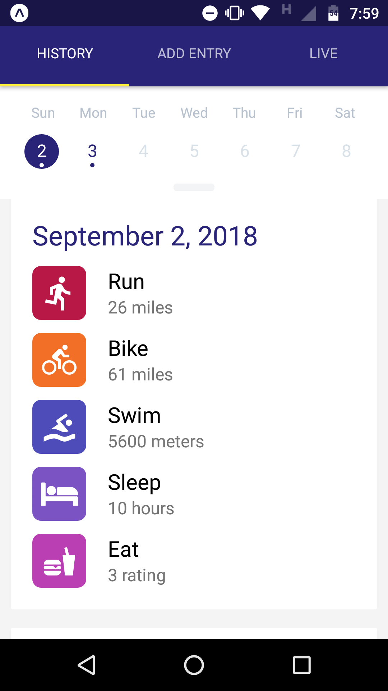
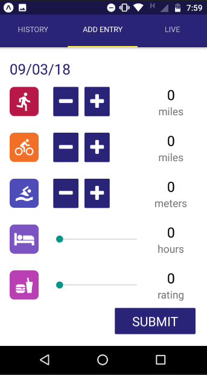
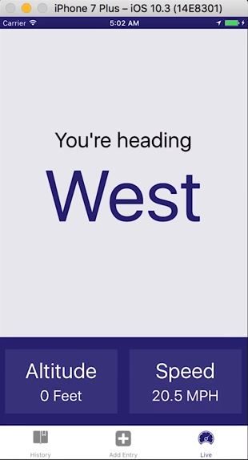

### UdaciFitness

UdaciFitness é um aplicativo para acompanhamento de triatlo(corrida, natação, ciclismo). 

### Instalando

```
clone git https://github.com/gilmarvoge/UdaciFitness.git

#para aplicação
-cd UdaciFitness
-yarn install
-yarn start

-utilizado app Expo para emular android/iOS
```




